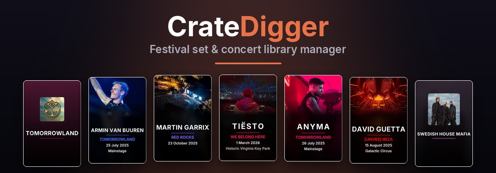
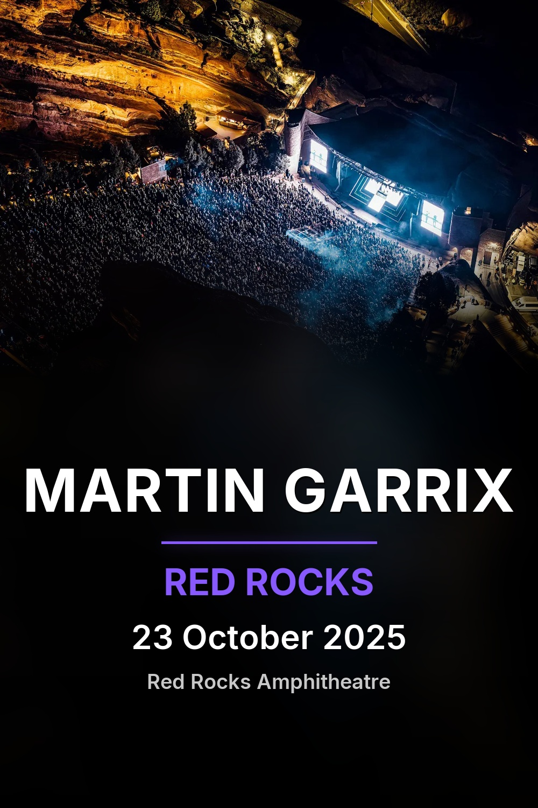
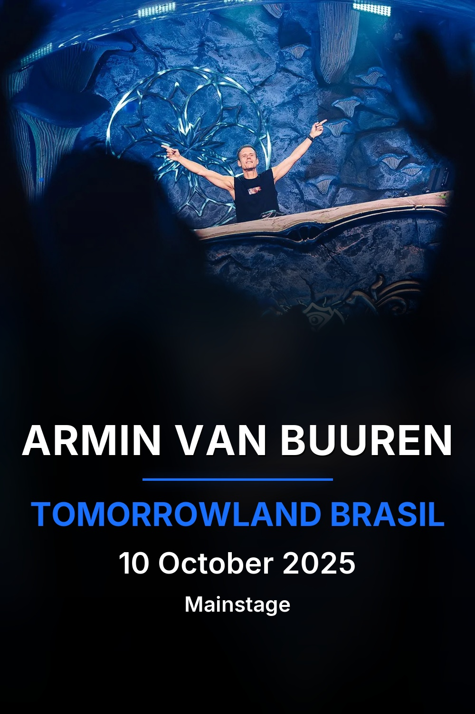
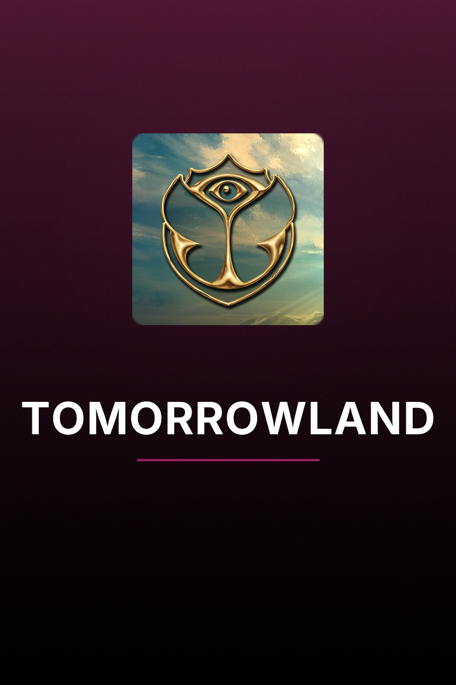
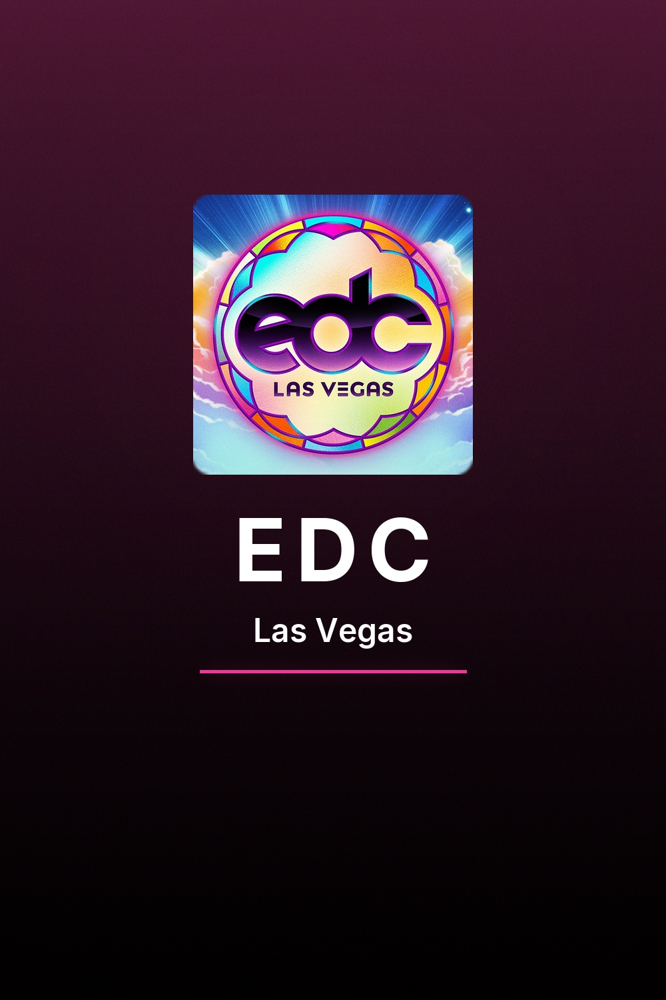
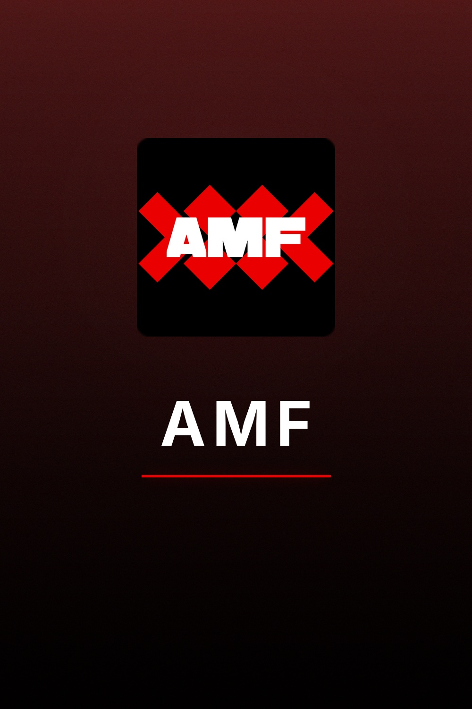

<p align="center">
  
  
  
</p>

<p align="center"><em>Festival set & concert library manager. Organize, enrich, and curate your collection with professional artwork, metadata, and chapter markers.</em></p>

## What is CrateDigger?

CrateDigger is a Python CLI tool for managing festival set and concert recording libraries. It follows a three-command workflow: **identify** matches recordings against 1001Tracklists and embeds chapter markers, **organize** moves files into your library with smart folder layouts, and **enrich** generates posters, artwork, NFO files, and embeds tags. CrateDigger integrates with Kodi for a polished media center experience, complete with artwork, metadata, and library sync.

> **Pair it with [TrackSplit](https://rouzax.github.io/TrackSplit/)** — a sibling CLI that extracts chapter-based audio from your video library into gapless, tagged FLAC albums for Jellyfin, Lyrion, and other music servers. TrackSplit reads CrateDigger's festival and artist config, so canonical naming and MusicBrainz IDs stay consistent across your video and music libraries.
> [Landing page](https://rouzax.github.io/TrackSplit/) · [Documentation](https://rouzax.github.io/TrackSplit/docs/) · [GitHub](https://github.com/Rouzax/TrackSplit)

## Poster Gallery

**Set Posters**

<table>
  <tr>
    <td></td>
    <td></td>
    <td></td>
    <td></td>
  </tr>
</table>

**Album Posters**

<table>
  <tr>
    <td></td>
    <td></td>
    <td></td>
  </tr>
</table>

## Features

### Identify

Match recordings against 1001Tracklists to retrieve full tracklist metadata. Chapter markers are embedded directly into MKV files, giving you track-by-track navigation. DJ artwork and event details are pulled in automatically.

### Organize

Sort your library using four folder layouts: `artist_flat`, `festival_flat`, `artist_nested`, and `festival_nested`. Sonarr-style collapsing tokens let you group events under a single folder (for example, grouping all Ultra stages together). Files can be copied, moved, or renamed in place.

### Enrich

Extract cover art from video files, fetch HD ClearLOGOs and artist fanart from fanart.tv, and generate posters in two distinct styles (set posters and album posters). Kodi-compatible NFO files are written alongside each recording. MKV tags are embedded with full metadata including artist, event, date, and tracklist info.

### Kodi Sync

Trigger library refreshes over JSON-RPC so Kodi picks up new content automatically. Automatic path mapping translates between local and Kodi filesystem paths. NFO files follow Kodi conventions for seamless scraper compatibility.

When a newer GitHub release is available, CrateDigger prints a one-line notice at startup with the exact upgrade command for your install method. The check is silent in non-interactive contexts (pipes, cron, CI). Set `CRATEDIGGER_NO_UPDATE_CHECK=1` to disable it entirely.

## Quick Start

### Prerequisites

- [Python 3.11+](https://www.python.org/downloads/)
- [MediaInfo](https://mediaarea.net/en/MediaInfo)
- [FFmpeg](https://ffmpeg.org/download.html)
- [MKVToolNix](https://mkvtoolnix.download/downloads.html)

### Install

**pipx (recommended for end users):** pipx installs CrateDigger into an isolated environment and puts the `cratedigger` command on your PATH automatically.

```bash
pipx install git+https://github.com/Rouzax/CrateDigger.git
```

Upgrade later with:

```bash
pipx upgrade cratedigger
```

**pip (user site or venv):** If you prefer pip or are working inside a virtual environment:

```bash
pip install git+https://github.com/Rouzax/CrateDigger.git
```

Upgrade later with:

```bash
pip install --upgrade git+https://github.com/Rouzax/CrateDigger.git
```

Optional: install with frame sampling support for higher-quality poster backgrounds (uses OpenCV to score video frames):

```bash
pip install "cratedigger[vision] @ git+https://github.com/Rouzax/CrateDigger.git"
```

Optional: run `./scripts/setup-hooks.sh` to install the pre-push hook that gates accidental release commits.

### Usage

```bash
# Step 1: Match recordings against 1001Tracklists and embed chapters
cratedigger identify /path/to/downloads

# Step 2: Organize files into your library
cratedigger organize /path/to/downloads --output /path/to/library

# Step 3: Generate artwork, posters, NFO files, and embed tags
cratedigger enrich /path/to/library
```

## Commands

| Command | Description |
|---------|-------------|
| `cratedigger identify` | Match recordings against 1001Tracklists and embed chapter markers |
| `cratedigger organize` | Move or copy files into your library with smart layouts |
| `cratedigger enrich` | Generate artwork, posters, NFO files, and embed tags |
| `cratedigger audit-logos` | Check festival logo coverage in your library |

## Configuration

CrateDigger reads settings from `~/.cratedigger/config.json` for global defaults and supports library-level configuration files for per-library overrides. A `config.example.json` is included in the repository as a starting point. See the [docs](docs/) folder for a full configuration reference.

## Disclaimer

Artwork displayed in this project is sourced from fanart.tv and 1001Tracklists. All artwork, logos, and trademarks belong to their respective owners. CrateDigger is not affiliated with any festival, artist, or platform shown.

## License

This project is licensed under the GPL-3.0 License. See [LICENSE](LICENSE) for details.
