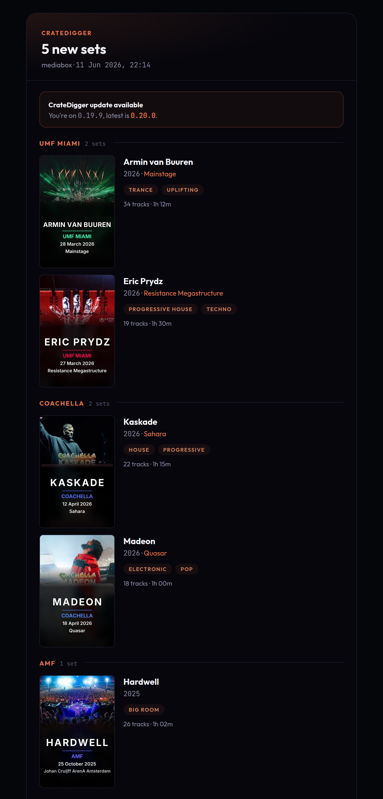

# Configuration

CrateDigger works without a config file. Built-in defaults cover everything. Create a config file only to override specific settings.

## Config file locations

CrateDigger merges configuration from three layers in this order, with later layers overriding earlier ones:

1. **Built-in defaults:** always present, covers all settings
2. **User config:** `~/CrateDigger/config.toml` (Linux / macOS) or `Documents\CrateDigger\config.toml` (Windows)
3. **Library config:** `{library}/.cratedigger/config.toml`

Only include the settings you want to change. Everything else falls back to built-in defaults.

You can also pass an explicit path with `--config <path>` on any command. This acts as your user config for that run.

### Custom data directory

Set the `CRATEDIGGER_DATA_DIR` environment variable to read and write the visible data folder (config, places, artists, logos) from a different location, for example a shared volume or an external drive. Both CrateDigger and TrackSplit honour this variable, so pointing them at the same path keeps them aligned. The directory must already exist; CrateDigger does not create it. If you want your existing data there, move or copy it yourself before setting the variable. CrateDigger falls back to the platform default when the variable is unset, empty, or points at a missing or non-directory path.

If you have cloned the CrateDigger repository into `~/CrateDigger/` on Linux or the equivalent default folder on other platforms, CrateDigger will warn at startup that the data folder appears to be a source checkout. Set `CRATEDIGGER_DATA_DIR` to a separate dedicated folder to resolve the warning and keep your curated data files away from the repository.

=== "Linux / macOS"

    ```bash
    export CRATEDIGGER_DATA_DIR=/data/cd
    ```

=== "Windows (PowerShell)"

    ```powershell
    $env:CRATEDIGGER_DATA_DIR = "D:\CrateDigger"
    ```

!!! note "Caches and logs live in separate platform directories"
    `CRATEDIGGER_DATA_DIR` only controls the visible data folder (config, places, artists, logos). Caches (`dj_cache.json`, `mbid_cache.json`, artist artwork) and logs follow standard platform conventions and are not affected by this variable. On Linux, they live under `~/.cache/CrateDigger/` and `~/.local/state/CrateDigger/log/` respectively. If you need to relocate those as well, set the standard `XDG_CACHE_HOME` or `XDG_STATE_HOME` environment variables. Note that these apply system-wide to all XDG-aware applications, and platformdirs appends `CrateDigger/` automatically, so `XDG_CACHE_HOME=/data/cache` results in `/data/cache/CrateDigger/`.

## Getting a starter config

The example config contains all available settings with comments. Copy it to your user config location:

=== "Linux / macOS"

    ```bash
    mkdir -p ~/CrateDigger
    curl -o ~/CrateDigger/config.toml \
      https://raw.githubusercontent.com/Rouzax/CrateDigger/main/config.example.toml
    ```

=== "Windows (PowerShell)"

    ```powershell
    New-Item -ItemType Directory -Force "$env:USERPROFILE\Documents\CrateDigger"
    Invoke-WebRequest `
      -Uri "https://raw.githubusercontent.com/Rouzax/CrateDigger/main/config.example.toml" `
      -OutFile "$env:USERPROFILE\Documents\CrateDigger\config.toml"
    ```

Or, if you have cloned the repository:

=== "Linux / macOS"

    ```bash
    cp config.example.toml ~/CrateDigger/config.toml
    ```

=== "Windows (PowerShell)"

    ```powershell
    Copy-Item config.example.toml "$env:USERPROFILE\Documents\CrateDigger\config.toml"
    ```

## Config sections

### Default layout

```toml
default_layout = "artist_flat"
```

The folder layout used by `organize` when `--layout` is not specified. Available values: `artist_flat`, `place_flat`, `artist_nested`, `place_nested`. The older names `festival_flat` and `festival_nested` are deprecated aliases for `place_flat` and `place_nested`; they continue to work until 1.0.0 but log a one-shot deprecation warning. See [Organize: layouts](commands/organize.md#layouts) for what each looks like.

### Layouts

```toml
[layouts.artist_flat]
festival_set = "{artist}"
concert_film = "{artist}"

[layouts.place_flat]
festival_set = "{place}{ edition}"
concert_film = "{artist}"

[layouts.artist_nested]
festival_set = "{artist}/{place}{ edition}/{year}"
concert_film = "{artist}/{year} - {title}"

[layouts.place_nested]
festival_set = "{place}{ edition}/{year}/{artist}"
concert_film = "{artist}/{year} - {title}"
```

Folder path templates for each layout and content type. The `{place}` token resolves to the canonical name of the festival, club, or venue associated with the set. See [Organize: template syntax](commands/organize.md#filename-template-syntax) for how optional tokens work.

**Deprecated layout names:** `festival_flat` and `festival_nested` are aliases for `place_flat` and `place_nested`. They resolve to the same layouts and use the same templates. If you have customised a `[layouts.festival_flat]` or `[layouts.festival_nested]` section in your config, CrateDigger uses your custom section unchanged and logs a one-shot deprecation warning. Support for the deprecated names will be removed in 1.0.0.

### Filename templates

```toml
[filename_templates]
festival_set = "{year} - {artist}{ - place}{ edition}{ [stage]}{ - set_title}"
concert_film = "{artist} - {title}{ (year)}"
```

Templates for generated filenames. The original file extension is preserved automatically. The `{ - place}` token is optional: it is included only when a place name is available. See [Organize: template syntax](commands/organize.md#filename-template-syntax) for field names and optional token syntax.

**Template tokens:** `{place}` is the primary routing token for the associated festival, club, or venue. The older `{festival}` token continues to work as a deprecated alias rendering the same value, and will be removed in 1.0.0.

### Content type rules

```toml
[content_type_rules]
force_concert = ["Adele/*", "Coldplay/*", "U2/*"]
force_festival = []
```

Path rules that force a file to be classified as `concert_film` or `festival_set`, bypassing automatic classification. Each rule is a pattern matched against the file's path relative to the source root. Use `*` to match anything within a single folder name, or `/*` after a folder name to match everything inside it. For example, `Coldplay/*` matches any file directly inside a `Coldplay` folder.

### Skip patterns

```toml
skip_patterns = ["*/BDMV/*", "Dolby*"]
```

Path patterns for files and folders to skip during scanning. Matched against the relative path. Useful for ignoring Blu-ray disc structures (`*/BDMV/*`) or demo content.

### Media extensions

```toml
[media_extensions]
video = [".mp4", ".mkv", ".webm", ".avi", ".mov", ".m2ts", ".ts"]
audio = [".mp3", ".m4a", ".flac", ".wav", ".aac", ".ogg", ".opus"]
```

File extensions recognized as media files, grouped by type. Add extensions here if CrateDigger is not picking up a file type you use.

### Fallback values

```toml
[fallback_values]
unknown_artist = "Unknown Artist"
unknown_place = "_Needs Review"
unknown_year = "Unknown Year"
unknown_title = "Unknown Title"
```

Placeholder values used in folder and filename templates when metadata is missing. `_Needs Review` sorts near the top in most file managers, making unclassified files easy to find.

**Deprecated key:** `unknown_festival` is a deprecated alias for `unknown_place`. If you set `unknown_festival` without also setting `unknown_place`, CrateDigger copies your value into `unknown_place` and logs a one-shot deprecation warning. Setting `unknown_place` directly is preferred. Support for `unknown_festival` will be removed in 1.0.0.

### Poster settings

```toml
[poster_settings]
artist_background_priority = ["dj_artwork", "fanart_tv", "gradient"]
place_background_priority = ["curated_logo", "gradient"]
year_background_priority = ["gradient"]
```

Priority chains for poster background image selection. CrateDigger tries each source in order and uses the first one available.

| Source | Description |
|--------|-------------|
| `dj_artwork` | DJ photo from 1001Tracklists (embedded during identify) |
| `fanart_tv` | Artist artwork from fanart.tv |
| `curated_logo` | Hand-placed place logo (see [audit-logos](commands/audit-logos.md)) |
| `gradient` | Color gradient generated from metadata (always available) |

`place_background_priority` controls background selection for festival sets routed by a named place (festival, club, or venue). When the set has no linked place, the `artist_background_priority` chain is used instead, so the poster comes out as a proper artist poster rather than a plain gradient.

**Deprecated key:** `festival_background_priority` is a deprecated alias for `place_background_priority`. If you set `festival_background_priority` without also setting `place_background_priority`, CrateDigger copies your value into `place_background_priority` and logs a one-shot deprecation warning. Support for `festival_background_priority` will be removed in 1.0.0.

### Tracklists

```toml
[tracklists]
email = ""
password = ""
delay_seconds = 5
chapter_language = "eng"
auto_select = false
genre_top_n = 5
overlay_chapters = true
overlay_fold_seconds = 20
chapter_title_labels = false
```

Settings for 1001Tracklists integration. See [Tracklists integration](tracklists.md) for account setup details.

| Key | Description |
|-----|-------------|
| `email` | 1001Tracklists account email |
| `password` | 1001Tracklists account password |
| `delay_seconds` | Pause between files during identify (default: `5`); override per run with `--delay` |
| `chapter_language` | Language code embedded in chapter names (default: `"eng"`) |
| `auto_select` | Set to `true` to make `--auto` the default for `identify` (default: `false`) |
| `genre_top_n` | Maximum genres written to the album-level tag; tallied by frequency, ties broken by first appearance; `0` disables the cap (default: `5`) |
| `overlay_chapters` | When `true` (default), "w/" overlay tracks are processed and either folded into the host chapter or given their own chapter; when `false`, overlays are ignored and only main-track chapters are written |
| `overlay_fold_seconds` | Seconds after the host main track an overlay must enter to become its own chapter; overlays inside the window fold in as `Artist A vs. Artist B - Title A vs. Title B`; `0` gives every timecoded overlay its own chapter; a large value folds everything (default: `20`) |
| `chapter_title_labels` | When `false` (default), the record label is omitted from the visible chapter title but still written to `CRATEDIGGER_TRACK_LABEL`; when `true`, chapter titles include the trailing `[Label]` (for example, `These Are The Times [STMPD]`) |

Credentials can also be set via environment variables: `TRACKLISTS_EMAIL` and `TRACKLISTS_PASSWORD`.

### Fanart

```toml
[fanart]
personal_api_key = ""
enabled = true
```

Settings for fanart.tv artist artwork lookups. A project API key is built into CrateDigger. Adding your own personal key improves rate limits for large libraries.

Get a personal API key at [fanart.tv](https://fanart.tv/get-an-api-key/).

| Key | Description |
|-----|-------------|
| `personal_api_key` | Your personal fanart.tv API key (optional) |
| `enabled` | Set to `false` to disable fanart.tv lookups entirely (default: `true`) |

Environment variable overrides: `FANART_PERSONAL_API_KEY`, `FANART_PROJECT_API_KEY` (for the built-in project key).

### Kodi

```toml
[kodi]
enabled = false
host = "localhost"
port = 8080
username = "kodi"
password = ""
```

Kodi JSON-RPC connection settings for automatic library refresh after `enrich` or `organize`. See [Kodi integration](kodi-integration.md) for setup instructions.

| Key | Description |
|-----|-------------|
| `enabled` | Set to `true` to enable Kodi sync (default: `false`) |
| `host` | Kodi host name or IP address (default: `"localhost"`) |
| `port` | Kodi JSON-RPC port (default: `8080`) |
| `username` | Kodi username (default: `"kodi"`) |
| `password` | Kodi password |

All Kodi settings can also be set via environment variables: `KODI_HOST`, `KODI_PORT`, `KODI_USERNAME`, `KODI_PASSWORD`.

### Email notifications

CrateDigger can send HTML run-summary emails after key commands. Emails are sent only when there is something to report; a run that changes nothing sends nothing (except possibly the throttled update reminder described below). Each message includes inline poster thumbnails and a plain-text fallback. No external dependencies are required; emails are sent using Python's standard library over SMTP.

There are three independent channels. Each has its own recipient list and can be enabled or disabled separately.

| Channel | Trigger | Typical recipients |
|---------|---------|-------------------|
| `new_sets` | After `organize`, when one or more sets were newly added to the library | You and anyone else who follows the collection |
| `updated_sets` | After `identify`, when chapters were added or changed on one or more sets | You only |
| `update_reminder` | After any command, when a newer CrateDigger version is available | You only |

The `update_reminder` channel is throttled: you receive at most one email per new release, not one per run. When a content email (`new_sets` or `updated_sets`) goes out in the same run, the update banner is embedded in that email instead and the standalone reminder is suppressed.

The email step runs after the command finishes and reports its progress on the console: a spinner shows the slow phases (resizing a thumbnail for every set, sending), followed by a one-line verdict such as `New-sets email -> sent to 2 recipients` or, on failure, `Email -> send failed (...)`. Runs that send nothing stay silent in normal mode.

#### Prerequisites

You need an SMTP server that accepts authenticated submissions. A local relay, a self-hosted mail server, or any provider that supports STARTTLS or SSL on port 587/465 works. Gmail, Fastmail, and similar providers work if you generate an app password.

#### Configuration

```toml
[email]
smtp_host = "mail.example.lan"
smtp_port = 587
smtp_security = "starttls"   # starttls | ssl | none
smtp_user = "cratedigger"
smtp_password = ""           # leave blank; use CRATEDIGGER_SMTP_PASSWORD instead
from_address = "cratedigger@example.lan"
thumbnail_width = 140

[email.new_sets]
enabled = true
to = ["you@example.com", "other@example.com"]

[email.updated_sets]
enabled = true
to = ["you@example.com"]

[email.update_reminder]
enabled = true
to = ["you@example.com"]
```

| Key | Description | Default |
|-----|-------------|---------|
| `smtp_host` | SMTP server hostname or IP | (required) |
| `smtp_port` | SMTP port | `587` |
| `smtp_security` | Connection security: `"starttls"`, `"ssl"`, or `"none"` | `"starttls"` |
| `smtp_user` | SMTP login username | (required) |
| `smtp_password` | SMTP password (see env var note below) | `""` |
| `from_address` | Sender address that appears in the From header | (required) |
| `thumbnail_width` | Width in pixels of embedded poster thumbnails | `140` |

Each channel sub-table (`[email.new_sets]`, `[email.updated_sets]`, `[email.update_reminder]`) has two keys:

| Key | Description |
|-----|-------------|
| `enabled` | Set to `true` to enable this channel |
| `to` | List of recipient addresses |

#### SMTP password

Set the password via the `CRATEDIGGER_SMTP_PASSWORD` environment variable rather than writing it into `config.toml`. The environment variable takes precedence over `smtp_password` in the config file and is never written to logs.

=== "Linux / macOS"

    ```bash
    export CRATEDIGGER_SMTP_PASSWORD=your-app-password
    ```

=== "Windows (PowerShell)"

    ```powershell
    $env:CRATEDIGGER_SMTP_PASSWORD = "your-app-password"
    ```

#### Verifying delivery

Run `cratedigger --email-test` to send a sample email and confirm your SMTP settings and rendering work. It takes no path, does not touch your library, and reports whether the message was sent or why it failed (for example, no recipients configured, or a connection error). It sends to the `[email.new_sets]` recipient list and works even while that channel is disabled, so you can test before turning it on.

```bash
cratedigger --email-test
```

You can also force or suppress an email for a single run without changing your config:

- `--email` on `organize` forces the `new_sets` email even if no sets were added.
- `--no-email` on `organize` or `identify` suppresses the email for that run.

See [organize options](commands/organize.md#options) and [identify options](commands/identify.md#options).

#### Example



### NFO settings

```toml
[nfo_settings]
genre_festival = "Electronic"
genre_concert = "Live"
```

Genre written into NFO files when no genre is available from 1001Tracklists metadata. `genre_festival` applies to festival sets; `genre_concert` applies to concert recordings.

### Tool paths

```toml
# [tool_paths]
# ffprobe = "C:/Program Files/ffmpeg/bin/ffprobe.exe"
# mkvextract = ""
# mkvpropedit = ""
# mkvmerge = ""
```

Explicit paths to external tools. Set these only if the tools are installed somewhere not on your system PATH. Omit a key (or leave an empty string) to let CrateDigger find them automatically via PATH.

### Cache TTL

```toml
[cache_ttl]
mbid_days = 90
dj_days = 90
source_days = 365
images_days = 90
```

Base lifetimes for CrateDigger's caches, in days. When a cache entry expires, CrateDigger refreshes it on the next lookup.

| Key | What it controls | Default |
|-----|-----------------|---------|
| `mbid_days` | MusicBrainz ID cache | 90 |
| `dj_days` | DJ name and alias cache | 90 |
| `source_days` | Source and venue name cache | 365 |
| `images_days` | Downloaded artwork and images | 90 |

Each entry's actual lifetime jitters by ±20% around the base value (for example, `mbid_days: 90` means entries live 72 to 108 days). This prevents all cached entries from expiring at the same time after a bulk first-run fill, which would cause a large number of network requests in one go.

## External config files

Three JSON files can live alongside your `config.toml` and control name resolution. They use the same location as your config file:

| Platform | Folder |
|----------|--------|
| Linux | `~/CrateDigger/` |
| macOS | `~/CrateDigger/` |
| Windows | `Documents\CrateDigger\` |

### places.json

Controls place name recognition, aliases, and editions. Places include festivals, clubs, venues, and any other named entities that host DJ sets in your library. CrateDigger includes built-in place knowledge. To add your own entries or customize aliases, place a `places.json` in the folder above. See [Places](places.md) for the file format and how to add entries.

**Curated assets directory:** logo and background images for each place go in `.cratedigger/places/<canonical-name>/logo.png` inside your library, or `.cratedigger/places/<canonical-name>/<edition>/logo.png` for edition-specific logos. CrateDigger also checks the old `.cratedigger/festivals/<name>/` path as a fallback and logs a one-shot deprecation notice on first use.

**Deprecated file:** `festivals.json` is a deprecated alias for `places.json`. When `places.json` is absent, CrateDigger reads `festivals.json` instead and logs a one-shot deprecation warning. Rename the file to `places.json` when you are ready to migrate. Support for `festivals.json` will be removed in 1.0.0.

### artists.json {#artist-aliases}

Controls artist name aliases and B2B group definitions.

Place it in the folder above (`~/CrateDigger/artists.json` on Linux or macOS, `Documents\CrateDigger\artists.json` on Windows). Example:

```json
{
    "aliases": {
        "Armin van Buuren": ["Rising Star"],
        "Martin Garrix": ["GRX"],
        "Nicky Romero": ["Monocule"]
    },
    "groups": [
        "Above & Beyond",
        "Swedish House Mafia",
        "W&W"
    ]
}
```

**`aliases`:** maps a canonical artist name to a list of aliases. When CrateDigger encounters an alias in a filename or tag, it substitutes the canonical name. Matching is case-insensitive and diacritics-insensitive.

**`groups`:** a manual list of act names that should be kept as-is even when they contain `&`, `B2B`, `vs.`, or `x` separators. As of v0.21.0, any act with a 1001Tracklists profile is kept whole automatically (resolved to its canonical name via the DJ cache), so you do not need a manual entry for those acts. This includes single acts whose name contains `&` (for example, "Above & Beyond") and named groups (for example, "Swedish House Mafia"). Manual entries are mainly useful for acts with no 1001Tracklists profile (for example, `"W&W"` if it has no profile) or to correct a name the DJ cache gets wrong. When an act is neither in `groups` nor known to 1001Tracklists, CrateDigger splits on the separator and uses only the first artist as the folder name.

## Artist MBID override file

`artist_mbids.json` is a flat JSON map from artist display name to MusicBrainz artist ID. It lives in the same folder as your config file:

| Platform | Path |
|----------|------|
| Linux | `~/CrateDigger/artist_mbids.json` |
| macOS | `~/CrateDigger/artist_mbids.json` |
| Windows | `Documents\CrateDigger\artist_mbids.json` |

It is checked first by both the `chapter_artist_mbids` and `album_artist_mbids` enrich operations, before the auto cache and any live MusicBrainz search.

```json
{
    "Afrojack": "3abb6f9f-5b6a-4f1f-8a2d-1111111111aa",
    "Oliver Heldens": "6e7dde91-4c02-47ea-a2b4-2222222222bb"
}
```

| Property | Value |
|----------|-------|
| Format | Flat JSON object: `{"Artist Name": "mbid-uuid"}` |
| Matching | Case-insensitive on the artist name |
| Precedence | Checked before the auto MBID cache and before any live MusicBrainz search |
| Expiry | Never expires |
| Written by CrateDigger | No; this file is only edited by you |

**Distinction from the auto MBID cache:** the auto cache is populated from MusicBrainz search results and expires after `cache_ttl.mbid_days`. It can be deleted and will refill. `artist_mbids.json` is your curated override list for artists that MusicBrainz searches misidentify or fail to find.

See [enrich: chapter_artist_mbids](commands/enrich.md#chapter_artist_mbids-per-track-artist-ids) for the fix workflow.

## Environment variables

| Variable | Overrides |
|----------|-----------|
| `CRATEDIGGER_DATA_DIR` | Default data directory for config, places, artists, and logos. Must point at an existing directory. See [Custom data directory](#custom-data-directory). |
| `TRACKLISTS_EMAIL` | `tracklists.email` |
| `TRACKLISTS_PASSWORD` | `tracklists.password` |
| `FANART_PROJECT_API_KEY` | Built-in fanart.tv project key |
| `FANART_PERSONAL_API_KEY` | `fanart.personal_api_key` |
| `KODI_HOST` | `kodi.host` |
| `KODI_PORT` | `kodi.port` |
| `KODI_USERNAME` | `kodi.username` |
| `KODI_PASSWORD` | `kodi.password` |
| `CRATEDIGGER_SMTP_PASSWORD` | `email.smtp_password` (takes precedence; preferred over storing the password in the config file) |
